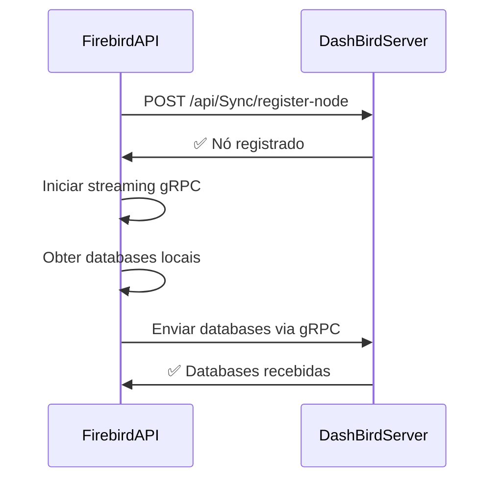
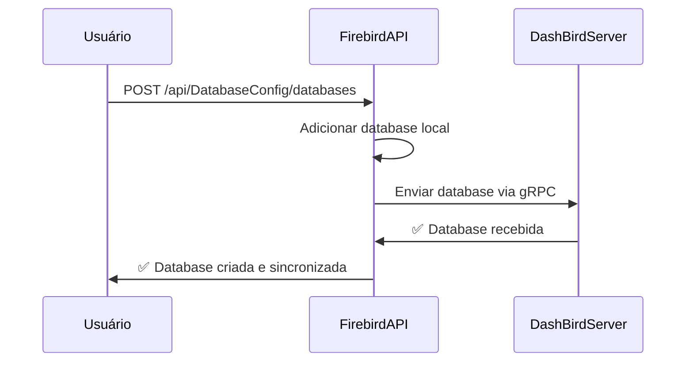
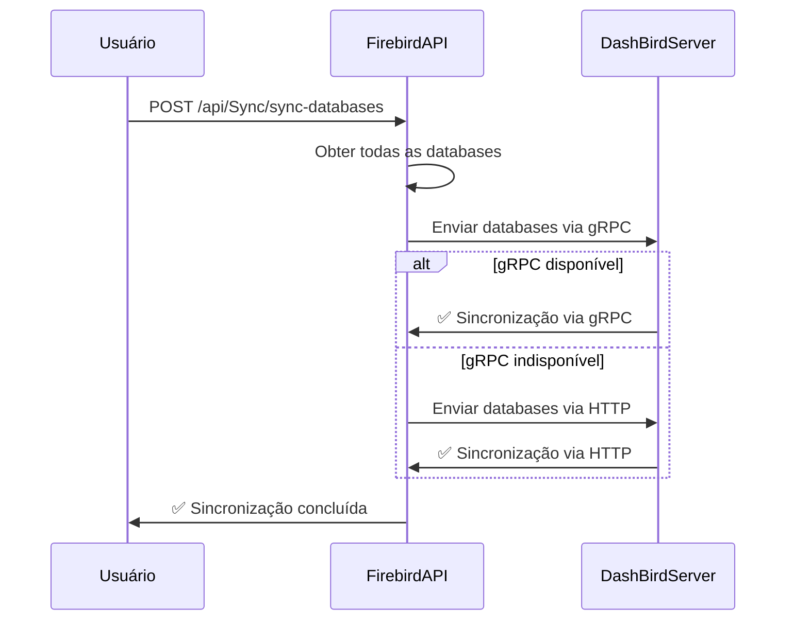

# Sistema de Sincronização de Bases de Dados - DashBird

## Visão Geral

Este documento descreve a implementação do sistema de sincronização de bases de dados configuradas entre o FirebirdAPI (client) e o DashBirdServer (cloud). O sistema oferece múltiplas formas de sincronização para garantir robustez e flexibilidade.

## Arquitetura

### Componentes Principais

1. **Protocolo gRPC** (`command.proto`)
   - Mensagens para sincronização de databases
   - Comandos para solicitar sincronização
   - Streaming bidirecional para comunicação em tempo real

2. **CommandStreamService** (FirebirdAPI)
   - Gerencia conexão gRPC com o servidor cloud
   - Processa comandos recebidos do servidor
   - Envia dados de sincronização via gRPC

3. **DatabaseConfigController** (FirebirdAPI)
   - Endpoints para gerenciar databases locais
   - Sincronização automática ao criar/atualizar databases
   - Fallback HTTP quando gRPC não está disponível

4. **SyncController** (FirebirdAPI)
   - Endpoints para sincronização manual
   - Sincronização automática no registro do nó
   - Múltiplos métodos de sincronização

## Tipos de Sincronização

### 1. Sincronização Automática
- **Quando**: Ao registrar um nó no servidor cloud
- **Método**: gRPC (preferido) → HTTP (fallback)
- **Escopo**: Todas as databases locais

### 2. Sincronização por Criação
- **Quando**: Ao adicionar uma nova database local
- **Método**: gRPC (preferido) → HTTP (fallback)
- **Escopo**: Database específica

### 3. Sincronização Manual
- **Quando**: Solicitada pelo usuário
- **Método**: gRPC (preferido) → HTTP (fallback)
- **Escopo**: Todas as databases locais

### 4. Sincronização por Comando
- **Quando**: Solicitada pelo servidor cloud via gRPC
- **Método**: gRPC
- **Escopo**: Configurável (todas ou específica)

## Endpoints Disponíveis

### FirebirdAPI (Client)

#### DatabaseConfigController
- `POST /api/DatabaseConfig/databases` - Adicionar database (sincroniza automaticamente)
- `POST /api/DatabaseConfig/sync-all-databases` - Sincronizar todas as databases
- `GET /api/DatabaseConfig/test-cloud-connection` - Testar conexão com cloud

#### SyncController
- `POST /api/Sync/register-node` - Registrar nó (sincroniza automaticamente)
- `POST /api/Sync/sync-databases` - Sincronização manual (gRPC + HTTP)
- `POST /api/Sync/sync-databases-grpc` - Sincronização apenas via gRPC
- `GET /api/Sync/database-status` - Status das databases locais
- `GET /api/Sync/streaming-status` - Status da conexão gRPC

### DashBirdServer (Cloud)

#### DatabaseConfigController
- `POST /api/DatabaseConfig/register-database` - Receber database do client
- `GET /api/DatabaseConfig/databases` - Listar todas as databases
- `GET /api/DatabaseConfig/node/{id}/databases` - Databases de um nó específico

## Fluxo de Sincronização

### 1. Registro de Nó com Sincronização Automática



### 2. Criação de Database com Sincronização



### 3. Sincronização Manual



## Estrutura de Dados

### DatabaseConfig (gRPC)
```protobuf
message DatabaseConfig {
  string id = 1;
  string name = 2;
  string server = 3;
  string database = 4;
  string username = 5;
  string password = 6;
  int32 port = 7;
  string charset = 8;
  int64 file_size_bytes = 9;
  int64 last_size_check = 10;
  int64 created_at = 11;
  bool is_active = 12;
}
```

### DatabaseSyncData (gRPC)
```protobuf
message DatabaseSyncData {
  string sync_type = 1; // "FULL_SYNC", "INCREMENTAL", "SINGLE_DATABASE"
  string database_id = 2; // ID específico (opcional)
  repeated DatabaseConfig databases = 3;
  string sync_reason = 4; // Motivo da sincronização
  int64 timestamp = 5;
}
```

## Comandos gRPC Disponíveis

### Cliente → Servidor
- `GET_DATABASES` - Listar databases locais
- `SYNC_DATABASES` - Sincronizar databases (resposta via gRPC)

### Servidor → Cliente
- `GET_SYSTEM_INFO` - Informações do sistema
- `GET_DATABASE_STATUS` - Status das databases
- `PING` - Teste de conectividade

## Configuração

### FirebirdAPI (appsettings.json)
```json
{
  "CloudServer": {
    "Url": "https://localhost:7001"
  }
}
```

### Variáveis de Ambiente
- `CloudServer__Url` - URL do servidor cloud

## Logs e Monitoramento

### Logs Importantes
- `✅ Database enviada via gRPC com sucesso`
- `⚠️ Falha ao enviar via gRPC, tentando HTTP`
- `🔄 Iniciando sincronização de databases via gRPC`
- `📤 Dados de sincronização de databases enviados via gRPC`

### Métricas Disponíveis
- Número de databases sincronizadas
- Método de sincronização utilizado (gRPC/HTTP)
- Tempo de sincronização
- Taxa de sucesso/falha

## Tratamento de Erros

### Estratégias de Fallback
1. **gRPC → HTTP**: Se gRPC falhar, tenta HTTP
2. **Retry Automático**: Reconexão automática do streaming
3. **Logs Detalhados**: Rastreamento completo de erros

### Códigos de Erro
- `400` - Requisição inválida
- `404` - Database não encontrada
- `500` - Erro interno do servidor
- `503` - Servidor cloud indisponível

## Testes

### Testar Sincronização
```bash
# 1. Registrar nó (sincroniza automaticamente)
curl -X POST http://localhost:8000/api/Sync/register-node \
  -H "Content-Type: application/json" \
  -d '{"machineId":"test-machine","name":"Test Node"}'

# 2. Sincronização manual via gRPC
curl -X POST http://localhost:8000/api/Sync/sync-databases-grpc

# 3. Verificar status
curl http://localhost:8000/api/Sync/database-status
```

### Testar Conexão
```bash
# Testar conexão com cloud
curl http://localhost:8000/api/DatabaseConfig/test-cloud-connection

# Verificar status do streaming
curl http://localhost:8000/api/Sync/streaming-status
```

## Melhorias Futuras

1. **Sincronização Incremental**: Apenas databases modificadas
2. **Compressão**: Comprimir dados grandes
3. **Batch Processing**: Processar múltiplas databases em lotes
4. **Retry Policies**: Políticas de retry mais sofisticadas
5. **Métricas Avançadas**: Dashboard de monitoramento

## Troubleshooting

### Problemas Comuns

1. **gRPC não conecta**
   - Verificar se o servidor cloud está rodando
   - Verificar certificados SSL
   - Verificar firewall/portas

2. **Sincronização falha**
   - Verificar logs para detalhes do erro
   - Testar conexão HTTP como fallback
   - Verificar se o nó está registrado

3. **Databases não aparecem no cloud**
   - Verificar se o MachineId está correto
   - Verificar se o nó está vinculado ao usuário
   - Verificar logs de sincronização

### Comandos de Debug
```bash
# Verificar status completo
curl http://localhost:8000/api/Sync/connection-health

# Forçar reconexão
curl -X POST http://localhost:8000/api/Sync/reconnect-streaming

# Sincronização forçada
curl -X POST http://localhost:8000/api/Sync/sync-databases
```
