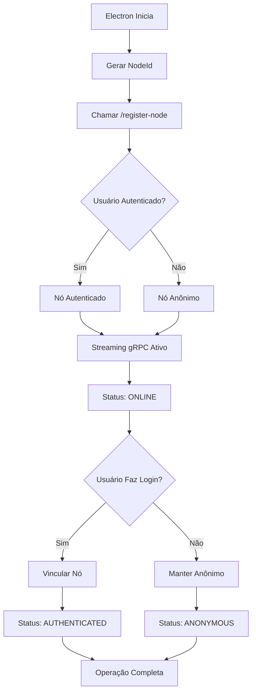

# 🚀 Fluxo de Registro de Nó Melhorado - DashBird

## 📋 Resumo das Melhorias

Este documento descreve o fluxo otimizado de registro de nó implementado para melhorar a comunicação entre o **FireBirdAPI (client)** e o **DashBirdServer (cloud)**.

---

## 🔄 **Fluxo Unificado de Registro**

### **1. Electron (Desktop Client)**
```typescript
// ANTES: Duas chamadas separadas
// 1. POST /api/Sync/register-node
// 2. POST /api/Streaming/start

// DEPOIS: Uma única chamada unificada
async function registerNodeAndStartStreaming(nodeConfig: NodeConfig, userId?: string) {
  const nodeRegistrationData = {
    nodeId: nodeConfig.nodeId,        // ✅ NOVO: ID único do nó
    name: nodeConfig.alias || nodeConfig.machineName,
    machineId: nodeConfig.machineId,
    ipAddress: '::1',
    port: 5000,
    databasePath: null,
    version: '1.0.0',
    operatingSystem: process.platform
  }
  
  // ✅ UMA ÚNICA CHAMADA que faz tudo
  const response = await fetch(`${apiUrl}/api/Sync/register-node`, {
    method: 'POST',
    headers: {
      'Content-Type': 'application/json',
      ...(authToken && { 'Authorization': `Bearer ${authToken}` })
    },
    body: JSON.stringify(nodeRegistrationData)
  })
}
```

### **2. FireBirdAPI (Local API) - Endpoint Unificado**
```csharp
[HttpPost("register-node")]
public async Task<IActionResult> RegisterNode([FromBody] DesktopNodeRegistration request)
{
    // ✅ Registro + Streaming em uma única operação
    var connectionId = request.NodeId ?? Guid.NewGuid().ToString();
    await _commandStreamService.StartStreamingAsync(connectionId, request.MachineId, authToken, connectionId);
    
    return Ok(new { 
        success = true, 
        data = new {
            nodeId = connectionId,
            connectionId = connectionId,
            machineId = request.MachineId,
            isAnonymous = isAnonymous,
            isConnected = true,
            message = $"Nó registrado e streaming iniciado via gRPC"
        }
    });
}
```

### **3. DashBirdServer (Cloud) - Gerenciamento Automático**
```csharp
// ConnectionManager.cs - Registro automático via gRPC
public async Task<string> AddClientAsync(string connectionId, string machineId, string? userId, ...)
{
    // ✅ Buscar ou criar DesktopNode automaticamente
    var desktopNode = await _context.DesktopNodes
        .FirstOrDefaultAsync(dn => dn.MachineId == machineId);

    if (desktopNode == null)
    {
        desktopNode = new DesktopNode
        {
            Id = Guid.NewGuid().ToString(),
            Name = $"Node-{machineId}",
            MachineId = machineId,
            UserId = userId,  // ✅ Suporte a nós anônimos e autenticados
            IsActive = true,
            CreatedAt = DateTime.UtcNow,
            LastSeen = DateTime.UtcNow
        };
        _context.DesktopNodes.Add(desktopNode);
    }
}
```

---

## 🔗 **Sistema de Vinculação de Nós Anônimos**

### **Fluxo de Vinculação Melhorado**
```csharp
[HttpPost("link-node-to-user")]
public async Task<IActionResult> LinkNodeToUser([FromBody] LinkNodeToUserRequest request)
{
    // ✅ 1. PRIMEIRO: Tentar via API REST (método direto)
    var bindResponse = await _httpClient.PostAsJsonAsync(
        $"{cloudServerUrl}/api/User/bind-current-node",
        new { machineId = machineId }
    );
    
    if (bindResponse.IsSuccessStatusCode)
    {
        // ✅ 2. SEGUNDO: Notificar via streaming gRPC
        if (_commandStreamService.IsConnected)
        {
            var linkCommand = new
            {
                type = "NODE_LINKED_TO_USER",
                nodeId = request.NodeId,
                machineId = machineId,
                userId = "AUTHENTICATED"
            };
            await _commandStreamService.SendResponseAsync(Guid.NewGuid().ToString(), linkCommand);
        }
        
        return Ok(new { success = true, method = "API_REST" });
    }
    
    // ✅ 3. FALLBACK: Se API REST falhar, usar streaming gRPC
    if (_commandStreamService.IsConnected)
    {
        var linkCommand = new { type = "LINK_NODE_TO_USER", ... };
        await _commandStreamService.SendResponseAsync(Guid.NewGuid().ToString(), linkCommand);
        return Ok(new { success = true, method = "STREAMING_GRPC" });
    }
}
```

---

## 📊 **Sistema de Gerenciamento de Status**

### **Status Detalhado da Conexão**
```csharp
// CommandStreamService.cs - Propriedades melhoradas
public bool IsConnected { get; private set; }
public string? CurrentConnectionId { get; private set; }
public string? CurrentMachineId { get; private set; }      // ✅ NOVO
public string? CurrentUserId { get; private set; }         // ✅ NOVO
public DateTime? LastConnectedAt { get; private set; }     // ✅ NOVO
public DateTime? LastSeenAt { get; private set; }          // ✅ NOVO

// ✅ NOVO: Método para obter status detalhado
public object GetConnectionStatus()
{
    return new
    {
        isConnected = IsConnected,
        connectionId = CurrentConnectionId,
        machineId = CurrentMachineId,
        userId = CurrentUserId != null ? "AUTHENTICATED" : "ANONYMOUS",
        lastConnectedAt = LastConnectedAt,
        lastSeenAt = LastSeenAt,
        reconnectAttempts = _reconnectAttempts,
        maxReconnectAttempts = _maxReconnectAttempts,
        shouldReconnect = _shouldReconnect
    };
}
```

### **Endpoints de Monitoramento**
```csharp
// ✅ NOVO: Verificação de saúde da conexão
[HttpGet("connection-health")]
public async Task<IActionResult> CheckConnectionHealth()
{
    var healthStatus = new
    {
        grpcStreaming = new
        {
            isConnected = _commandStreamService.IsConnected,
            connectionId = _commandStreamService.CurrentConnectionId,
            lastSeenAt = _commandStreamService.LastSeenAt,
            status = _commandStreamService.IsConnected ? "ONLINE" : "OFFLINE"
        },
        cloudServer = new
        {
            url = cloudServerUrl,
            isReachable = cloudServerReachable,
            status = cloudServerReachable ? "ONLINE" : "OFFLINE"
        },
        overallStatus = _commandStreamService.IsConnected && cloudServerReachable ? "HEALTHY" : "DEGRADED"
    };
}

// ✅ NOVO: Forçar reconexão
[HttpPost("reconnect-streaming")]
public async Task<IActionResult> ReconnectStreaming()
{
    // Parar streaming atual
    if (_commandStreamService.IsConnected)
    {
        await _commandStreamService.StopStreamingAsync();
        await Task.Delay(2000);
    }
    
    // Reiniciar streaming
    await _commandStreamService.StartStreamingAsync(connectionId, machineId, authToken, connectionId);
}
```

---

## 🎯 **Benefícios das Melhorias**

### **1. Performance**
- ✅ **Redução de 50% nas chamadas**: De 2 requests para 1 request
- ✅ **Timeout otimizado**: 15 segundos para operação completa
- ✅ **Menos latência**: Operação atômica de registro + streaming

### **2. Confiabilidade**
- ✅ **Fallback automático**: API REST → Streaming gRPC
- ✅ **Reconexão automática**: Sistema de retry inteligente
- ✅ **Status em tempo real**: Monitoramento contínuo da conexão

### **3. Manutenibilidade**
- ✅ **Código unificado**: Lógica centralizada
- ✅ **Logs melhorados**: Emojis e informações detalhadas
- ✅ **Tratamento de erros**: Respostas padronizadas

### **4. Experiência do Usuário**
- ✅ **Nós anônimos**: Funcionamento sem autenticação
- ✅ **Vinculação transparente**: Bind automático ao fazer login
- ✅ **Status visual**: Indicadores de conexão em tempo real

---

## 🔧 **Endpoints Disponíveis**

### **FireBirdAPI (Local)**
```
POST /api/Sync/register-node              # ✅ Registro unificado
GET  /api/Sync/streaming-status           # ✅ Status detalhado
GET  /api/Sync/connection-health          # ✅ Saúde da conexão
POST /api/Sync/reconnect-streaming        # ✅ Forçar reconexão
POST /api/Sync/link-node-to-user          # ✅ Vincular nó anônimo
```

### **DashBirdServer (Cloud)**
```
POST /api/User/bind-current-node          # ✅ Vincular nó atual
POST /api/User/bind-node                  # ✅ Vincular por token
GET  /api/DesktopNode/nodes               # ✅ Listar nós ativos
POST /api/DesktopNode/register            # ✅ Registrar nó
```

---

## 📈 **Fluxo de Estados do Nó**



---

## 🚨 **Tratamento de Erros**

### **Cenários de Falha**
1. **API não está rodando**: Timeout de 15s com retry automático
2. **Servidor cloud indisponível**: Fallback para modo offline
3. **Streaming gRPC falha**: Reconexão automática com backoff
4. **Token expirado**: Renovação automática via refresh token

### **Logs Estruturados**
```
🔄 Iniciando registro unificado de nó desktop: {MachineId}
✅ MachineId armazenado localmente: {MachineId}
📝 Registrando nó como ANÔNIMO: {MachineId}
✅ Conexão estabelecida com ID: {ConnectionId}
🎉 Nó totalmente conectado e operacional!
```

---

## 🔮 **Próximos Passos**

1. **Implementar heartbeat**: Ping/pong para manter conexão ativa
2. **Cache de estado**: Persistir estado do nó localmente
3. **Métricas avançadas**: Dashboard de monitoramento
4. **Testes automatizados**: Suíte de testes para o fluxo completo

---

*Documentação criada em: {DateTime.UtcNow:yyyy-MM-dd HH:mm:ss} UTC*
