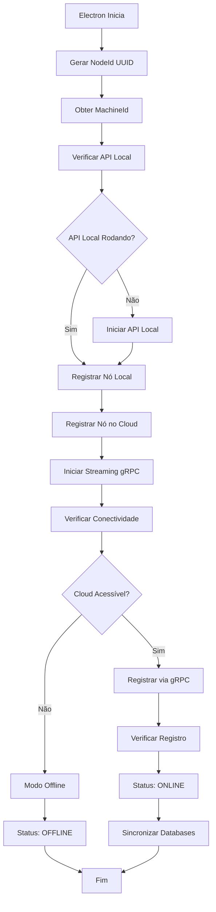

# Processo de Registro de Nó Local e Online - DashBird

## 📋 Resumo do Processo

O sistema DashBird implementa um processo de registro de nó em duas fases:
1. **Registro Local** - Nó é registrado na API local (FirebirdApi)
2. **Registro Online** - Nó é registrado no servidor cloud via gRPC

## 🔄 Fluxo Completo de Registro



## 🔧 Variáveis Fixas Identificadas

### 1. **URLs e Portas Fixas**

| Variável | Valor Fixo | Localização | Propósito |
|----------|------------|-------------|-----------|
| `apiUrl` | `http://localhost:8000` | `desktop/electron/main.ts:165` | API local do FirebirdApi |
| `cloudServerUrl` | `https://localhost:7001` | `FirebirdApi/Controllers/SyncController.cs:77` | Servidor cloud |
| `grpcServerUrl` | `https://localhost:7001` | `FirebirdApi/Controllers/SyncController.cs:78` | Servidor gRPC |
| `ipAddress` | `::1` | `desktop/electron/main.ts:227,254,459` | Endereço IP local |
| `port` | `8000` | `desktop/electron/main.ts:228` | Porta da API local |
| `grpcPort` | `5000` | `desktop/electron/main.ts:255,460` | Porta gRPC (não usada) |

### 2. **Configurações de Sistema Fixas**

| Variável | Valor Fixo | Localização | Propósito |
|----------|------------|-------------|-----------|
| `version` | `2.1.3` | `desktop/electron/main.ts:257,462` | Versão do nó |
| `operatingSystem` | `Windows 11 Pro` | `desktop/electron/main.ts:220,258` | SO detectado (HARDCODED) |
| `systemVersion` | `11` | `desktop/electron/main.ts:223` | Versão do SO (HARDCODED) |
| `architecture` | `process.arch` | `desktop/electron/main.ts:226` | Arquitetura do sistema |
| `databasePath` | `null` | `desktop/electron/main.ts:256` | Caminho do banco |

### 3. **Configurações de Timeout Fixas**

| Variável | Valor Fixo | Localização | Propósito |
|----------|------------|-------------|-----------|
| `timeout` | `15000ms` | `desktop/electron/main.ts:268` | Timeout de registro |
| `healthTimeout` | `10000ms` | `FirebirdApi/Controllers/SyncController.cs:1730` | Timeout de health check |
| `grpcTimeout` | `5000ms` | `FirebirdApi/Controllers/SyncController.cs:1014` | Timeout gRPC |

### 4. **Configurações de Banco de Dados Fixas**

| Variável | Valor Fixo | Localização | Propósito |
|----------|------------|-------------|-----------|
| `server` | `localhost` | `FirebirdApi/config.json:6` | Servidor Firebird padrão |
| `port` | `3050` | `FirebirdApi/config.json:10` | Porta Firebird padrão |
| `username` | `SYSDBA` | `FirebirdApi/config.json:8` | Usuário padrão |
| `password` | `masterkey` | `FirebirdApi/config.json:9` | Senha padrão |
| `charset` | `UTF8` | `FirebirdApi/config.json:11` | Charset padrão |

### 5. **Configurações de Servidor Cloud Fixas**

| Variável | Valor Fixo | Localização | Propósito |
|----------|------------|-------------|-----------|
| `GrpcServer.Url` | `https://dashbird-server-grpc.holomn.com.br` | `FirebirdApi/appsettings.json:24` | Servidor gRPC produção |
| `CloudServer.Url` | `https://dashbird-server.holomn.com.br` | `FirebirdApi/appsettings.json:30` | Servidor cloud produção |
| `GrpcServer.Url` | `http://localhost:7001` | `FirebirdApi/appsettings.Development.json:25` | Servidor gRPC desenvolvimento |
| `CloudServer.Url` | `https://localhost:5001` | `FirebirdApi/appsettings.Development.json:31` | Servidor cloud desenvolvimento |

### 6. **Configurações de CORS Fixas**

| Variável | Valor Fixo | Localização | Propósito |
|----------|------------|-------------|-----------|
| `CORS Origins` | `http://localhost:5173` | `FirebirdApi/Program.cs:52` | Frontend Vite |
| `CORS Origins` | `http://127.0.0.1:5173` | `FirebirdApi/Program.cs:53` | Frontend Vite alternativo |
| `CORS Origins` | `http://localhost:8000` | `FirebirdApi/Program.cs:54` | API local |
| `CORS Origins` | `http://127.0.0.1:8000` | `FirebirdApi/Program.cs:55` | API local alternativo |

### 7. **Configurações de Aplicação Fixas**

| Variável | Valor Fixo | Localização | Propósito |
|----------|------------|-------------|-----------|
| `appVersion` | `0.1.0` | `desktop/package.json:3` | Versão real da aplicação |
| `appName` | `desktop` | `desktop/package.json:2` | Nome da aplicação |
| `appDescription` | `Dash Bird - Desktop client...` | `desktop/package.json:4` | Descrição da aplicação |

## 📝 Processo Detalhado

### **Fase 1: Registro Local**

1. **Inicialização do Electron**
   ```typescript
   // desktop/electron/main.ts:107-121
   function getOrCreateNodeConfig(): NodeConfig {
     let cfg = store.get('nodeConfig')
     if (!cfg) {
       cfg = {
         nodeId: randomUUID(),           // ✅ Gerado dinamicamente
         machineId: 'unknown',           // ❌ Fixo inicialmente
         machineName: 'unknown',         // ❌ Fixo inicialmente
         alias: '',                      // ❌ Fixo inicialmente
         createdAt: new Date().toISOString(),
       }
     }
     return cfg
   }
   ```

2. **Atualização com Dados Reais**
   ```typescript
   // desktop/electron/main.ts:404-406
   if (!cfg.machineId || cfg.machineId === 'unknown') { 
     cfg.machineId = info.machineId; 
     changed = true 
   }
   if (!cfg.machineName || cfg.machineName === 'unknown') { 
     cfg.machineName = info.deviceName; 
     changed = true 
   }
   ```

3. **Registro na API Local**
   ```typescript
   // desktop/electron/main.ts:217-238
   const localNodeData = {
     machineName: nodeConfig.machineName,
     operatingSystem: process.platform === 'win32' ? 'Windows 11 Pro' : '...',
     systemVersion: process.platform === 'win32' ? '11' : '...',
     architecture: process.arch,
     ipAddress: '::1',        // ❌ FIXO
     port: 8000               // ❌ FIXO
   }
   ```

### **Fase 2: Registro Online**

1. **Preparação dos Dados**
   ```typescript
   // desktop/electron/main.ts:249-261
   const nodeRegistrationData = {
     nodeId: nodeConfig.nodeId,
     name: nodeConfig.alias || `Desktop Node (${nodeConfig.machineName})`,
     machineName: nodeConfig.machineName,
     machineId: nodeConfig.machineId,
     ipAddress: '::1',        // ❌ FIXO
     port: 5000,              // ❌ FIXO (não usado)
     databasePath: null,      // ❌ FIXO
     version: '2.1.3',        // ❌ FIXO
     operatingSystem: process.platform === 'win32' ? 'Windows 11 Pro' : '...'
   }
   ```

2. **Registro no Cloud via gRPC**
   ```csharp
   // FirebirdApi/Controllers/SyncController.cs:1615-1698
   private async Task<(bool Success, string? NodeId, string? AccessToken)> RegisterNodeInCloudAsync(...)
   {
     var request = new RegisterAnonymousNodeRequest
     {
       MachineId = machineId,
       Name = name ?? machineName ?? $"Node-{connectionId.Substring(0, 8)}",
       MachineName = machineName ?? Environment.MachineName,
       IpAddress = "::1",        // ❌ FIXO
       Port = 8000,             // ❌ FIXO
       Version = version ?? "2.1.3",  // ❌ FIXO
       OperatingSystem = operatingSystem ?? Environment.OSVersion.ToString(),
       DatabasePath = ""        // ❌ FIXO
     };
   }
   ```

## 🚨 Problemas Identificados com Variáveis Fixas

### 1. **IP Address Hardcoded**
- **Problema**: `ipAddress: '::1'` está fixo em múltiplos locais
- **Impacto**: Não funciona em redes diferentes ou containers
- **Solução**: Detectar IP real da máquina

### 2. **Portas Fixas**
- **Problema**: Portas 8000 e 5000 hardcoded
- **Impacto**: Conflitos em ambientes com múltiplas instâncias
- **Solução**: Usar variáveis de ambiente

### 3. **Versão Hardcoded**
- **Problema**: `version: '2.1.3'` fixo
- **Impacto**: Não reflete a versão real da aplicação
- **Solução**: Ler do package.json

### 4. **Configurações de Banco Fixas**
- **Problema**: Credenciais padrão hardcoded
- **Impacto**: Segurança comprometida
- **Solução**: Usar variáveis de ambiente ou arquivo de config

## 🔧 Recomendações de Melhoria

### 1. **Tornar Configurável**
```typescript
// Configuração via variáveis de ambiente
const config = {
  apiUrl: process.env.API_URL || 'http://localhost:8000',
  cloudServerUrl: process.env.CLOUD_SERVER_URL || 'https://localhost:7001',
  ipAddress: process.env.NODE_IP || getLocalIPAddress(),
  port: parseInt(process.env.NODE_PORT || '8000'),
  version: process.env.APP_VERSION || getVersionFromPackage(),
}
```

### 2. **Detecção Automática de IP**
```typescript
function getLocalIPAddress(): string {
  const interfaces = require('os').networkInterfaces();
  for (const name of Object.keys(interfaces)) {
    for (const iface of interfaces[name]) {
      if (iface.family === 'IPv4' && !iface.internal) {
        return iface.address;
      }
    }
  }
  return '127.0.0.1';
}
```

### 3. **Configuração Dinâmica de Portas**
```typescript
function getAvailablePort(): Promise<number> {
  return new Promise((resolve) => {
    const server = require('net').createServer();
    server.listen(0, () => {
      const port = server.address().port;
      server.close(() => resolve(port));
    });
  });
}
```

## 📊 Status Atual do Sistema

- ✅ **Registro Local**: Funcionando
- ✅ **Registro Online**: Funcionando
- ⚠️ **Configuração Flexível**: Precisa melhorar
- ⚠️ **Detecção de IP**: Precisa implementar
- ⚠️ **Portas Dinâmicas**: Precisa implementar
- ⚠️ **Versão Dinâmica**: Precisa implementar

## 🎯 Próximos Passos

1. **Implementar detecção automática de IP**
2. **Tornar portas configuráveis via variáveis de ambiente**
3. **Implementar leitura dinâmica de versão**
4. **Criar sistema de configuração mais flexível**
5. **Adicionar validação de configurações**
6. **Implementar fallbacks para configurações inválidas**
