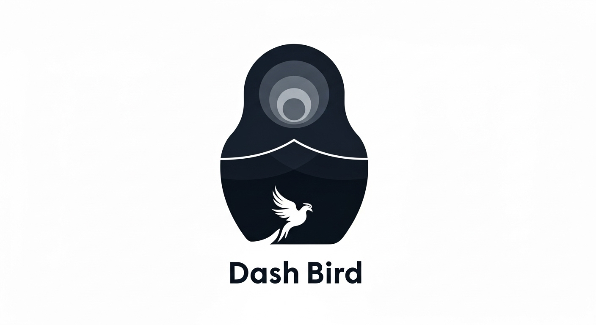
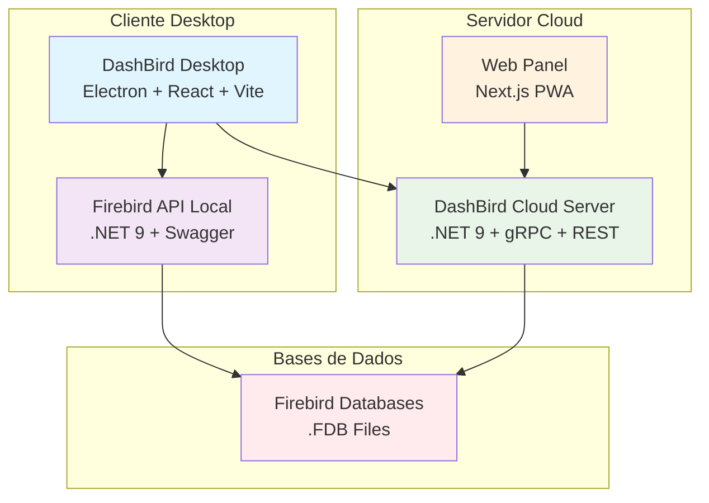

# DashBird — Plataforma Completa de Gerenciamento de Bases Firebird



DashBird é uma plataforma completa e moderna para gerenciamento, sincronização e monitoramento de bases de dados Firebird. A solução oferece uma arquitetura híbrida que combina aplicações desktop, servidor cloud e painel web para fornecer controle total sobre suas bases de dados.

> 📚 **Documentação da Estrutura da Base de Dados**: Para uma análise detalhada da estrutura das bases Firebird suportadas, consulte a [Documentação da Estrutura da Base](DOCUMENTACAO_ESTRUTURA_BASE.md).

## 🏗️ Arquitetura do Sistema

### Componentes Principais



### Estrutura do Repositório

#### 📱 **DashBird Desktop** (`desktop/`)

- **Tecnologia**: Electron + React + Vite + TypeScript
- **Funcionalidades**: Interface desktop para gerenciamento local de bases Firebird
- **Recursos**: Dashboard estratégico, Query Tool, configurações de bases
- **Integração**: Comunica com API local e servidor cloud

#### 🌐 **DashBird Cloud** (`dash-bird-clould/`)

- **DashBird Server**: API .NET 9 com REST + gRPC para sincronização
- **Web Panel**: Interface web Next.js PWA para gerenciamento remoto
- **Funcionalidades**: Sincronização em tempo real, sistema multi-usuário, streaming bidirecional

#### 🔧 **Firebird API** (`FirebirdApi/`)

- **Tecnologia**: .NET 9 + Swagger + Entity Framework
- **Funcionalidades**: API local para operações Firebird, gerenciamento de configurações
- **Integração**: Ponte entre desktop e bases de dados locais

#### 🧪 **Firebird Test** (`FirebirdTest/`)

- **Tecnologia**: Console .NET 9
- **Funcionalidades**: Teste de conectividade e validação de configurações


## 🚀 Funcionalidades Principais

### 💻 **DashBird Desktop**

- **Dashboard Estratégico**: Análises visuais para tomada de decisão baseada em dados
- **Query Tool**: Editor SQL avançado com syntax highlighting
- **Gerenciamento de Bases**: Configuração e teste de múltiplas bases Firebird
- **Sincronização Local**: Integração com servidor cloud para sync em tempo real
- **Interface Moderna**: UI responsiva e intuitiva com Electron

### ☁️ **DashBird Cloud Server**

- **APIs Duplas**: Suporte completo para REST e gRPC
- **Sincronização Inteligente**: Sync inicial, incremental e resolução de conflitos
- **Sistema Multi-usuário**: Autenticação JWT com suporte a nós anônimos
- **Streaming Bidirecional**: Comunicação em tempo real via gRPC
- **Gerenciamento de Nós**: Controle de múltiplas máquinas desktop conectadas
#### **gRPC Services** (`http://localhost:7001`)
- `DashBirdService` - Operações Firebird via gRPC
- `CommandService` - Streaming bidirecional
- `NodeRegistrationService` - Registro de nós

### **Comandos gRPC do Servidor para Cliente**

O sistema DashBird implementa um sistema de streaming bidirecional gRPC que permite ao servidor cloud enviar comandos para clientes desktop conectados em tempo real.

#### **Como Funciona**
- **Streaming Bidirecional**: O cliente mantém uma conexão persistente com o servidor
- **Processamento Automático**: Os comandos são processados automaticamente pelo cliente
- **Logs Completos**: Todas as interações são logadas no banco de dados
- **Reconexão Automática**: O cliente tenta reconectar automaticamente em caso de desconexão

#### **Comandos Disponíveis**

##### **1. GET_SYSTEM_INFO**
- **Descrição**: Retorna informações detalhadas do sistema operacional do cliente
- **Resposta**: 
  ```json
  {
    "machineId": "string",
    "os": "string", 
    "version": "string",
    "processorCount": "number",
    "workingSet": "number",
    "timestamp": "datetime"
  }
  ```

##### **2. GET_DATABASE_STATUS**
- **Descrição**: Verifica o status da conexão com o banco de dados Firebird
- **Resposta**:
  ```json
  {
    "connected": "boolean",
    "timestamp": "datetime"
  }
  ```

##### **3. GET_DATABASES**
- **Descrição**: Lista todas as configurações de bancos de dados do cliente
- **Resposta**:
  ```json
  {
    "databases": [
      {
        "id": "string",
        "name": "string", 
        "server": "string",
        "database": "string",
        "username": "string",
        "port": "number",
        "charset": "string",
        "fileSizeBytes": "number",
        "lastSizeCheck": "datetime",
        "createdAt": "datetime",
        "isActive": "boolean"
      }
    ],
    "count": "number",
    "timestamp": "datetime"
  }
  ```

##### **4. SYNC_DATABASES**
- **Descrição**: Solicita ao cliente que sincronize suas configurações de banco de dados com o servidor
- **Funcionalidade**: O cliente envia automaticamente todos os dados de configuração de bancos via gRPC
- **Resposta**:
  ```json
  {
    "success": "boolean",
    "message": "string",
    "databasesCount": "number", 
    "timestamp": "datetime"
  }
  ```

##### **5. PING**
- **Descrição**: Teste básico de conectividade
- **Resposta**:
  ```json
  {
    "message": "pong",
    "timestamp": "datetime"
  }
  ```

#### **Envio de Comandos via API REST**

Os comandos podem ser enviados através da API REST do servidor:

##### **Para uma conexão específica:**
```http
POST /api/Connection/{connectionId}/command
Authorization: Bearer {seu-token}
Content-Type: application/json

{
  "command": "GET_SYSTEM_INFO",
  "metadata": "{\"priority\": \"high\"}"
}
```

##### **Para todas as conexões de uma máquina:**
```http
POST /api/Connection/machine/{machineId}/command
Authorization: Bearer {seu-token}
Content-Type: application/json

{
  "command": "GET_DATABASE_STATUS"
}
```

##### **Para todas as conexões de um usuário:**
```http
POST /api/Connection/user/{userId}/command
Authorization: Bearer {seu-token}
Content-Type: application/json

{
  "command": "PING"
}
```

#### **Características do Sistema de Comandos**

- **Autenticação JWT**: Suporte a autenticação via token JWT
- **Sincronização de Dados**: Sistema integrado para sincronização de configurações de banco
- **Monitoramento**: Rastreamento de comandos enviados e respostas recebidas
- **Tratamento de Erros**: Sistema robusto de tratamento de erros e reconexão
- **Logs Detalhados**: Logs completos de todas as operações para auditoria

---

### 🌐 **DashBird Web Panel**

- **Interface Web Moderna**: PWA responsiva com Next.js
- **Monitoramento Remoto**: Acompanhamento de nós e bases em tempo real
- **Gerenciamento de Usuários**: Sistema completo de autenticação e autorização
- **Relatórios Avançados**: Dashboards e métricas detalhadas
- **Download de Aplicações**: Sistema de distribuição do cliente desktop

## 📋 Requisitos do Sistema

### **Desenvolvimento**

- Node.js 20+ e pnpm
- .NET 9 SDK
- Firebird Server (2.5/3/4) instalado e rodando
- Acesso a arquivos `.FDB` válidos

### **Produção**

- Windows 10+ (cliente desktop)
- Servidor com .NET 9 Runtime
- Firebird Server configurado
- Conexão com internet (para funcionalidades cloud)

## 🔌 Portas e URLs

### **Desenvolvimento Local**

- **Desktop App**: `http://localhost:5173` (Vite dev server)
- **Firebird API Local**: `http://localhost:5000` (API local)
- **Cloud Server**: `http://localhost:7001` (gRPC) + `http://localhost:5001` (REST)
- **Web Panel**: `http://localhost:3000` (Next.js)

### **Produção**

- **Cloud Server**: `https://dashbird-clould.holomn.com.br`
- **Web Panel**: `https://dashbird-clould.holomn.com.br`
- **gRPC**: `https://dashbird-clould.holomn.com.br:7001`

---

## 🚀 Como Executar o Projeto

### **Opção 1: Execução Completa (Recomendada)**

#### 1️⃣ **DashBird Cloud Server + Web Panel**

```bash
# Navegar para o projeto cloud
cd dash-bird-clould

# Executar com Docker Compose (mais fácil)
docker-compose up -d

# OU executar manualmente:

# Terminal 1 - Cloud Server
cd DashBirdServer
dotnet restore
dotnet run

# Terminal 2 - Web Panel  
cd dashbird-web-panel
pnpm install
pnpm dev
```

**URLs de Acesso:**
- Web Panel: `http://localhost:3000`
- Cloud Server API: `http://localhost:5001/api`
- Swagger: `http://localhost:5001/swagger`
- gRPC: `http://localhost:7001`

#### 2️⃣ **DashBird Desktop + Firebird API Local**

```bash
# Terminal 3 - Firebird API Local
cd FirebirdApi
dotnet restore
dotnet run

# Terminal 4 - Desktop App
cd desktop
pnpm install
pnpm dev
```

**URLs de Acesso:**
- Desktop App: `http://localhost:5173` (via Electron)
- Firebird API Local: `http://localhost:5000`
- Swagger Local: `http://localhost:5000/swagger`

### **Opção 2: Execução Individual**

#### 🔧 **Apenas Firebird API Local**

```bash
cd FirebirdApi
dotnet restore
dotnet run
```

#### 💻 **Apenas Desktop App**

```bash
cd desktop
pnpm install
pnpm dev
```

#### ☁️ **Apenas Cloud Server**

```bash
cd dash-bird-clould/DashBirdServer
dotnet restore
dotnet run
```

#### 🌐 **Apenas Web Panel**

```bash
cd dash-bird-clould/dashbird-web-panel
pnpm install
pnpm dev
```

### **🔧 Solução de Problemas**

#### **Electron não inicia corretamente**

```bash
cd desktop
pnpm run electron:install
pnpm dev
```

#### **Dependências ausentes no Vite**

```bash
cd desktop
pnpm add react-router-dom lucide-react
pnpm dev
```

#### **API não responde**

- Verifique se o Firebird Server está rodando
- Confirme o caminho do arquivo `.FDB` em `appsettings.json`
- Teste conectividade com `FirebirdTest`

#### **Cloud Server não conecta**

- Verifique se as portas 5001 e 7001 estão livres
- Confirme configurações de CORS
- Verifique logs do servidor

---

## ⚡ Funcionalidades Detalhadas

### 🖥️ **DashBird Desktop**

#### **Dashboard Estratégico**
- Análise de produtos mais rentáveis
- Controle de tempo de produção
- Monitoramento de estoque e perdas
- Cálculo de margens e rentabilidade
- Relatórios visuais para tomada de decisão

#### **Gerenciamento de Bases**
- Configuração de múltiplas bases Firebird
- Teste de conectividade em tempo real
- Listagem e exploração de tabelas
- Visualização de schemas e metadados
- Backup e restauração de configurações

#### **Query Tool**
- Editor SQL avançado com syntax highlighting
- Execução de queries SELECT, DML e DDL
- Resultados em formato tabular
- Histórico de consultas
- Exportação de resultados

### ☁️ **DashBird Cloud Server**

#### **Sistema Multi-usuário**
- Autenticação JWT segura
- Gerenciamento de usuários e permissões
- Suporte a nós anônimos
- Vinculação de nós desktop a usuários
- Controle de acesso granular

#### **Sincronização Inteligente**
- Sync inicial completo
- Sincronização incremental
- Detecção automática de conflitos
- Resolução inteligente de conflitos
- Rastreamento de mudanças

#### **APIs Duplas (REST + gRPC)**
- **REST API**: Operações CRUD e gerenciamento
- **gRPC**: Streaming bidirecional e operações em tempo real
- Documentação Swagger completa
- Health checks e monitoramento

### 🌐 **DashBird Web Panel**

#### **Interface Web Moderna**
- PWA responsiva para todos os dispositivos
- Dashboard em tempo real
- Gerenciamento de nós remotos
- Monitoramento de sincronização
- Sistema de notificações

#### **Gerenciamento Avançado**
- Controle de usuários e permissões
- Configuração de bases remotas
- Relatórios e métricas detalhadas
- Sistema de download de aplicações
- Configurações globais

## 🔌 APIs e Endpoints

### **Firebird API Local** (`http://localhost:5000`)

#### **Configuração de Bases**
- `GET /api/DatabaseConfig/databases` - Listar bases
- `POST /api/DatabaseConfig/databases` - Criar base
- `GET /api/DatabaseConfig/databases/{id}` - Obter base
- `PUT /api/DatabaseConfig/databases/{id}` - Atualizar base
- `DELETE /api/DatabaseConfig/databases/{id}` - Remover base

#### **Operações Firebird**
- `GET /api/Firebird/test-connection` - Testar conexão
- `POST /api/Firebird/execute-query` - Executar SELECT
- `POST /api/Firebird/execute-non-query` - Executar DML/DDL
- `POST /api/Firebird/execute-scalar` - Executar escalar
- `GET /api/Firebird/tables` - Listar tabelas

### **DashBird Cloud Server** (`http://localhost:5001`)

#### **Sistema de Usuários**
- `POST /api/User/register` - Registrar usuário
- `POST /api/User/login` - Login
- `GET /api/User/profile` - Perfil do usuário
- `POST /api/User/validate-token` - Validar token

#### **Gerenciamento de Nós**
- `POST /api/DesktopNode/register` - Registrar nó
- `GET /api/DesktopNode/nodes` - Listar nós
- `POST /api/DesktopNode/nodes/{id}/sync-timestamp` - Atualizar sync

#### **Sincronização**
- `POST /api/Sync/initial-sync` - Sync inicial
- `POST /api/Sync/incremental-sync` - Sync incremental
- `GET /api/Sync/status/{nodeId}/{dbId}` - Status de sync

#### **gRPC Services** (`http://localhost:7001`)
- `DashBirdService` - Operações Firebird via gRPC
- `CommandService` - Streaming bidirecional
- `NodeRegistrationService` - Registro de nós

---

## 🔄 Fluxos de Trabalho

### **Fluxo do DashBird Desktop**

#### **1. Inicialização**
1. **Startup**: Electron inicia e carrega interface React
2. **Registro de Nó**: Sistema registra automaticamente o nó no cloud
3. **Verificação de API**: Confirma conectividade com API local e cloud
4. **Carregamento de Bases**: Lista bases configuradas localmente

#### **2. Gerenciamento de Bases**
1. **Home**: Exibe dashboard com bases configuradas
2. **Adicionar Base**: Interface para configurar nova base Firebird
3. **Teste de Conexão**: Validação automática de conectividade
4. **Exploração**: Navegação por tabelas e schemas

#### **3. Sincronização**
1. **Registro no Cloud**: Nó se registra no servidor cloud
2. **Sync Inicial**: Primeira sincronização completa
3. **Sync Incremental**: Atualizações automáticas
4. **Resolução de Conflitos**: Interface para resolver conflitos

### **Fluxo do DashBird Cloud**

#### **1. Autenticação**
1. **Registro/Login**: Usuário se autentica via Web Panel
2. **Vinculação de Nós**: Conecta nós desktop ao usuário
3. **Gerenciamento de Tokens**: Controle de acesso JWT

#### **2. Sincronização**
1. **Recebimento de Dados**: Cloud recebe dados dos nós
2. **Processamento**: Análise e validação dos dados
3. **Distribuição**: Envio para outros nós conectados
4. **Resolução de Conflitos**: Sistema inteligente de resolução

### **Fluxo do Web Panel**

#### **1. Monitoramento**
1. **Dashboard**: Visão geral do sistema
2. **Status de Nós**: Monitoramento em tempo real
3. **Métricas**: Relatórios e estatísticas
4. **Alertas**: Notificações de problemas

#### **2. Gerenciamento**
1. **Usuários**: Controle de acesso e permissões
2. **Configurações**: Ajustes globais do sistema
3. **Downloads**: Distribuição de aplicações
4. **Relatórios**: Análises detalhadas

## 🔧 Integração Técnica

### **Electron + React**
- **IPC Handlers**: Comunicação entre processos
- **API Management**: Controle automático de APIs
- **File System**: Acesso seguro ao sistema de arquivos
- **Auto-update**: Sistema de atualizações automáticas

### **gRPC Streaming**
- **Bidirectional**: Comunicação em tempo real
- **Command Processing**: Execução remota de comandos
- **Health Monitoring**: Monitoramento de conectividade
- **Error Handling**: Tratamento robusto de erros

### **Sincronização de Dados**
- **Conflict Detection**: Detecção automática de conflitos
- **Data Integrity**: Validação de integridade
- **Performance**: Otimização para grandes volumes
- **Recovery**: Recuperação automática de falhas

---

## ⚙️ Configuração e Persistência

### **Configurações Locais**
- **Firebird API**: `FirebirdApi/config.json` (configuração inicial)
- **Desktop App**: `%APPDATA%/Dash Bird/` (configurações do usuário)
- **Bases Dinâmicas**: `database-configs.json` (gerado automaticamente)

### **Configurações Cloud**
- **SQLite Database**: `dashbird.db` (dados do servidor)
- **User Data**: Tabelas de usuários, nós e sincronização
- **Sync Status**: Controle de estado de sincronização

### **Segurança e Criptografia**
- **JWT Tokens**: Autenticação segura com expiração
- **Password Hashing**: SHA256 com salt configurável
- **HTTPS**: Comunicação criptografada em produção
- **CORS**: Configuração restritiva para APIs

---

## 🔒 Segurança e Boas Práticas

### **Autenticação e Autorização**
- **JWT Tokens**: Tokens seguros com expiração automática
- **Role-based Access**: Controle granular de permissões
- **Anonymous Nodes**: Suporte seguro para uso sem registro
- **Token Validation**: Validação contínua de tokens

### **Proteção de Dados**
- **SQL Injection**: Validação e sanitização de queries
- **HTTPS Only**: Comunicação criptografada obrigatória
- **Input Validation**: Validação rigorosa de entradas
- **Error Handling**: Logs seguros sem exposição de dados

### **Monitoramento e Auditoria**
- **Activity Logs**: Rastreamento completo de operações
- **Connection Monitoring**: Monitoramento de conexões ativas
- **Performance Metrics**: Métricas de performance e uso
- **Security Alerts**: Alertas de segurança em tempo real

---

## 🧹 Manutenção e Limpeza

### **Limpeza de Branch**
Para garantir builds limpos ao mudar de branch:

```bash
# Limpeza com confirmação
pnpm run clean-branch

# Limpeza forçada (sem confirmação)
pnpm run clean-branch:force
```

📖 **Guia Completo**: Consulte [CLEAN_BRANCH_GUIDE.md](CLEAN_BRANCH_GUIDE.md) para detalhes.

### **Build e Deploy**

```bash
# Build completo
pnpm run build:full

# Build para Windows
pnpm run build:windows

# Build com assinatura digital
pnpm run build:windows:signed
```

## 🔧 Troubleshooting

### **Problemas de Conectividade**

- **Firebird não conecta**: Verifique serviço ativo e porta 3050
- **API não responde**: Confirme se `dotnet run` está executando
- **Cloud não conecta**: Verifique portas 5001/7001 e CORS
- **Desktop não carrega**: Execute `pnpm run electron:install`

### **Problemas de Sincronização**

- **Sync falha**: Verifique conectividade com cloud
- **Conflitos não resolvidos**: Use interface de resolução
- **Dados não aparecem**: Confirme permissões de usuário

### **Problemas de Build**

- **Dependências ausentes**: Execute `pnpm install`
- **Cache corrompido**: Use `pnpm run clean-branch`
- **Electron não instala**: Delete `node_modules/electron` e reinstale

## 📚 Documentação Adicional

- [Documentação da Estrutura da Base](DOCUMENTACAO_ESTRUTURA_BASE.md)
- [Guia de Limpeza de Branch](CLEAN_BRANCH_GUIDE.md)
- [Setup de Assinatura Digital](CODE_SIGNING_SETUP.md)
- [Processo de Build](BUILD_PROCESS.md)
- [Implementação de Sync](DATABASE_SYNC_IMPLEMENTATION.md)

## 🤝 Contribuição

1. Fork o projeto
2. Crie uma branch para sua feature (`git checkout -b feature/AmazingFeature`)
3. Commit suas mudanças (`git commit -m 'Add some AmazingFeature'`)
4. Push para a branch (`git push origin feature/AmazingFeature`)
5. Abra um Pull Request

## 📄 Licenças e Créditos

- **Firebird®**: Marca registrada de seus respectivos mantenedores
- **FirebirdSql.Data.FirebirdClient**: Driver oficial para .NET
- **Electron**: Framework para aplicações desktop
- **Next.js**: Framework React para web
- **gRPC**: Sistema de comunicação de alta performance

---

**DashBird** - Plataforma completa para gerenciamento de bases de dados Firebird 🐦✨
