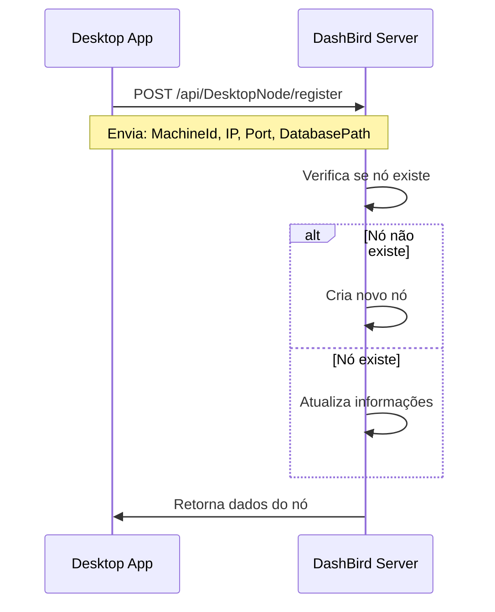
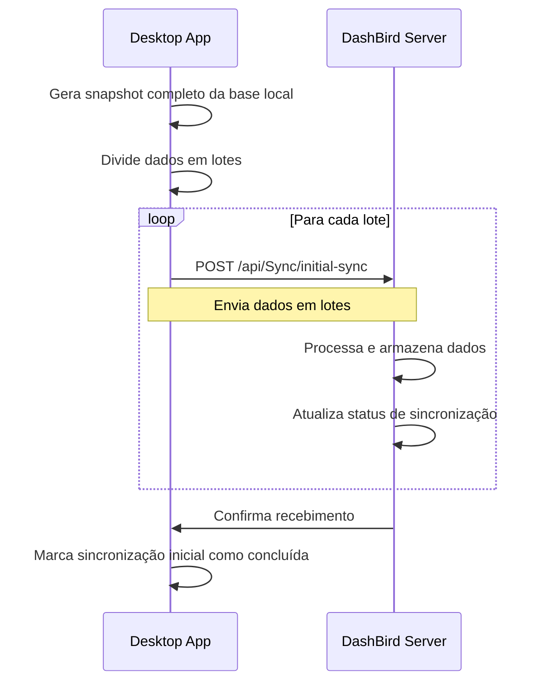
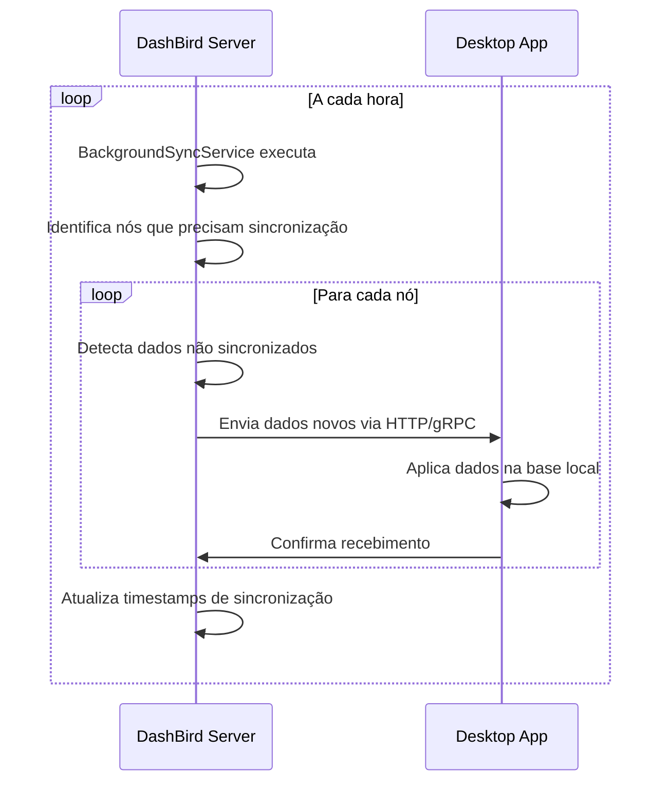
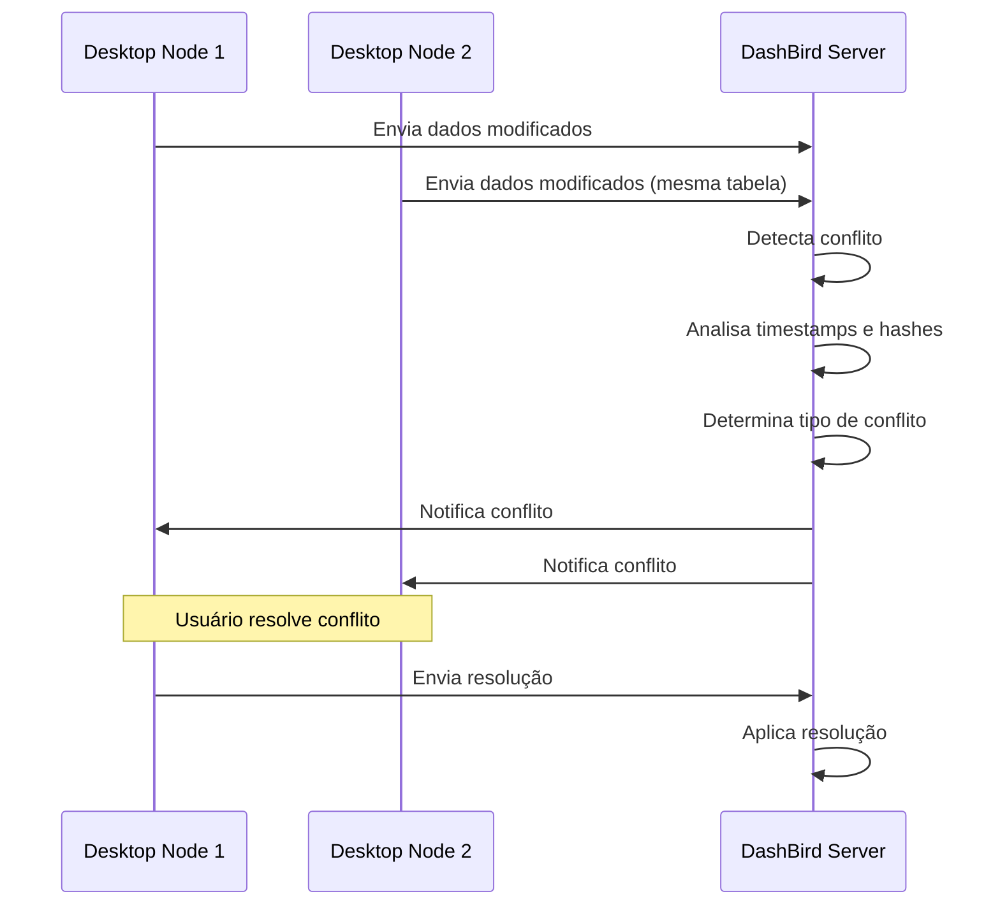

# Fluxo de Sincronização Dash Bird

## Visão Geral

Este documento descreve o sistema de sincronização implementado entre o aplicativo desktop (Electron) e o servidor (DashBirdServer) para manter os dados sincronizados em tempo real.

## Arquitetura

### Componentes Principais

1. **Desktop (Electron App)**
   - `SyncService`: Gerencia comunicação com o servidor
   - `LocalDataService`: Detecta mudanças nos dados locais
   - `useSync` Hook: Interface React para sincronização
   - `SyncStatus` Component: UI para status de sincronização

2. **Servidor (DashBirdServer)**
   - `DesktopNodeController`: Gerencia registro de nós desktop
   - `SyncController`: Controla operações de sincronização
   - `ConflictController`: Detecta e resolve conflitos
   - `BackgroundSyncService`: Sincronização periódica automática

## Fluxo de Sincronização

### 1. Registro do Nó Desktop



**Implementação:**
- Desktop se registra automaticamente ao iniciar
- Servidor mantém registro de todos os nós ativos
- Atualiza informações como IP, porta, versão, etc.

### 2. Sincronização Inicial



**Implementação:**
- Desktop gera snapshot completo de todas as tabelas
- Envia dados em lotes para evitar sobrecarga
- Servidor armazena dados e atualiza status
- Sistema detecta quando sincronização inicial está completa

### 3. Sincronização Periódica (A cada hora)



**Implementação:**
- Servidor executa serviço em background
- Detecta dados que mudaram desde última sincronização
- Envia dados para nós desktop ativos
- Desktop aplica mudanças na base local

### 4. Detecção de Conflitos



**Implementação:**
- Sistema detecta quando múltiplos nós modificam os mesmos dados
- Compara timestamps e hashes para determinar conflitos
- Oferece opções de resolução (usar dados do nó, servidor, ou merge manual)

## Modelos de Dados

### DesktopNode
```csharp
public class DesktopNode
{
    public string Id { get; set; }
    public string Name { get; set; }
    public string MachineId { get; set; }
    public string IpAddress { get; set; }
    public int Port { get; set; }
    public string? DatabasePath { get; set; }
    public DateTime LastSeen { get; set; }
    public bool IsActive { get; set; }
    public string? LastSyncTimestamp { get; set; }
}
```

### SyncData
```csharp
public class SyncData
{
    public string Id { get; set; }
    public string DesktopNodeId { get; set; }
    public string DatabaseId { get; set; }
    public string TableName { get; set; }
    public string Data { get; set; } // JSON
    public string DataHash { get; set; }
    public DateTime SyncTimestamp { get; set; }
    public string? SyncType { get; set; } // INITIAL, INCREMENTAL, FULL
}
```

### SyncStatus
```csharp
public class SyncStatus
{
    public string Id { get; set; }
    public string DesktopNodeId { get; set; }
    public string DatabaseId { get; set; }
    public DateTime LastFullSync { get; set; }
    public DateTime LastIncrementalSync { get; set; }
    public string? LastSyncHash { get; set; }
    public int TotalTables { get; set; }
    public int SyncedTables { get; set; }
    public string? SyncStatus { get; set; } // PENDING, IN_PROGRESS, COMPLETED, ERROR
}
```

## Endpoints da API

### Desktop Node Management
- `POST /api/DesktopNode/register` - Registrar/atualizar nó desktop
- `GET /api/DesktopNode/nodes` - Listar nós ativos
- `POST /api/DesktopNode/nodes/{machineId}/sync-timestamp` - Atualizar timestamp
- `POST /api/DesktopNode/nodes/{machineId}/deactivate` - Desativar nó

### Sincronização
- `POST /api/Sync/initial-sync` - Sincronização inicial
- `POST /api/Sync/incremental-sync` - Sincronização incremental
- `GET /api/Sync/unsynced-data/{desktopNodeId}/{databaseId}` - Dados não sincronizados
- `GET /api/Sync/status/{desktopNodeId}/{databaseId}` - Status de sincronização
- `GET /api/Sync/active-operations` - Operações ativas

### Detecção de Conflitos
- `GET /api/Conflict/detect/{desktopNodeId}/{databaseId}` - Detectar conflitos
- `GET /api/Conflict/unsynced/{desktopNodeId}/{databaseId}` - Dados não sincronizados
- `POST /api/Conflict/resolve/{conflictId}` - Resolver conflito
- `GET /api/Conflict/changes/{databaseId}` - Histórico de mudanças
- `GET /api/Conflict/stats/{databaseId}` - Estatísticas de sincronização

## Configuração

### Servidor (appsettings.json)
```json
{
  "GrpcServer": {
    "Url": "https://localhost:7001",
    "Timeout": 30,
    "MaxRetryAttempts": 3
  },
  "SyncSettings": {
    "PeriodicSyncInterval": "01:00:00",
    "ConflictDetectionEnabled": true,
    "MaxRetryAttempts": 3
  }
}
```

### Desktop
```typescript
const syncService = new SyncService('https://localhost:7001')
syncService.startPeriodicSync(databaseId, getTableDataCallback)
```

## Monitoramento e Logs

### Logs do Servidor
- Registro de nós desktop
- Operações de sincronização
- Detecção de conflitos
- Erros de comunicação

### Logs do Desktop
- Status de sincronização
- Erros de comunicação
- Aplicação de dados do servidor

### Métricas
- Número de nós ativos
- Frequência de sincronização
- Taxa de conflitos
- Tempo de resposta

## Tratamento de Erros

### Cenários de Erro
1. **Nó desktop offline**: Servidor marca como inativo, tenta reconectar
2. **Falha na comunicação**: Retry automático com backoff exponencial
3. **Conflitos de dados**: Sistema detecta e oferece opções de resolução
4. **Dados corrompidos**: Validação de hash e reenvio se necessário

### Estratégias de Recuperação
- Retry automático com limites
- Fallback para sincronização manual
- Backup de dados antes de aplicar mudanças
- Logs detalhados para debugging

## Segurança

### Autenticação
- Validação de MachineId único
- Verificação de IP e porta
- Timeout de sessão

### Integridade de Dados
- Hash SHA256 para verificação
- Timestamps para ordenação
- Validação de schema antes de aplicar

## Performance

### Otimizações
- Envio em lotes para dados grandes
- Compressão de dados JSON
- Índices de banco para consultas rápidas
- Cache de status de sincronização

### Limites
- Máximo 1000 registros por lote
- Timeout de 5 minutos para operações
- Máximo 10 tentativas de retry

## Próximos Passos

1. **Implementar compressão de dados**
2. **Adicionar autenticação JWT**
3. **Implementar sincronização em tempo real via SignalR**
4. **Adicionar dashboard de monitoramento**
5. **Implementar backup automático**
6. **Adicionar testes automatizados**
